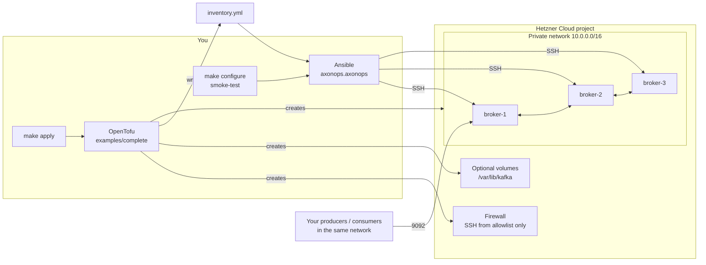

<p align="center">
  <a href="https://digitalis.io">
    
  </a>
</p>

<p align="center">
  <em>Built and maintained by <a href="https://digitalis.io">Digitalis.IO</a>: Apache Kafka experts, 24x7 managed services and consultancy</em>
</p>

<p align="center">
  <a href="#quick-start">Quick start</a> ·
  <a href="#examples">Examples</a> ·
  <a href="#need-help-running-kafka">Need help running Kafka?</a> ·
  <a href="https://digitalis.io/contact">Talk to an engineer</a>
</p>

# Apache Kafka on Hetzner Cloud

Production-shaped Apache Kafka (KRaft, no ZooKeeper) on Hetzner Cloud in one
command sequence: OpenTofu builds the infrastructure, Ansible installs and
verifies Kafka.

```bash
make apply ENVIRONMENT=dev && make galaxy configure smoke-test
```

Hetzner Cloud gives you fast, low-cost European (and US/Singapore) compute.
This project turns it into a Kafka cluster with the defaults we use for our
own managed-service customers, so you start from a sound baseline instead of a
blank VM.

## Why use it

| You get | How |
|---------|-----|
| **A working cluster, proven on every run** | `make smoke-test` produces and consumes a message across the private network; `make configure` fails unless the KRaft quorum has elected a leader |
| **Durable by default** | New topics get replication factor 3 and `min.insync.replicas` 2 (scaled down for smaller clusters); topic auto-creation is off |
| **Kafka off the public internet** | Brokers advertise private IPs only. The public firewall allows SSH from your allowlist and nothing else; ports 9092/9093 are never opened |
| **Hardware failure isolation** | Brokers and controllers sit in Hetzner *spread* placement groups, so no two share a physical host |
| **Your choice of topology** | Combined broker+controller nodes for small clusters, or a dedicated 3/5-node controller quorum with up to 10 brokers |
| **Data that survives a rebuild** | Optional delete-protected Hetzner volumes per broker, formatted and mounted automatically, never reformatted |
| **Infrastructure you can review** | Plain OpenTofu and Ansible, optional remote state on Hetzner Object Storage, validated inputs, and policy tests (terraform-compliance, `tofu test`, ansible-lint, molecule) in CI |
| **Built on the AxonOps toolchain** | Configured with the [`axonops.axonops`](https://github.com/axonops/axonops-ansible-collection) collection, which also installs the [AxonOps](https://axonops.com) agent for Kafka monitoring and management (switched on in a coming release) |

## How it works



1. **OpenTofu** (`modules/kafka-cluster`) creates the private network, an
   SSH-only firewall, spread placement groups, servers, optional data volumes
   and an Ansible inventory (`inventory.yml`). Every server's cloud-init brings
   up its private network interface.
2. **Ansible** (`ansible/`) installs Java and Kafka 4.x in KRaft mode, waits
   for the quorum, and runs a produce/consume smoke test.
3. **Make** drives the whole lifecycle from the repo root.

Clients connect over the Hetzner private network. Design notes:
[architecture](docs/architecture.md) and [ADRs](docs/adr/).

## Contents

- [Quick start](#quick-start)
- [Examples](#examples)
- [Make targets](#make-targets)
- [Configuration reference](#configuration-reference)
- [Outputs reference](#outputs-reference)
- [Operations and caveats](#operations-and-caveats)
- [Repository layout](#repository-layout)
- [Need help running Kafka?](#need-help-running-kafka)

## Quick start

Requirements: OpenTofu >= 1.10, GNU Make, Ansible and a Hetzner Cloud
project. State is local by default; [remote state](#remote-state-recommended)
is recommended for shared or long-lived clusters.

```bash
# 1. Credentials (environment only, never in files)
export HCLOUD_TOKEN=<hetzner-cloud-api-token>

# 2. Parameters: your SSH public key and your IP
cp params/fsn1/dev/params.tfvars.example params/fsn1/dev/params.tfvars
$EDITOR params/fsn1/dev/params.tfvars

# 3. Infrastructure (writes inventory.yml in the repo root)
make plan  ENVIRONMENT=dev LOCATION=fsn1
make apply ENVIRONMENT=dev LOCATION=fsn1

# 4. Kafka
make galaxy configure smoke-test
```

`make apply` costs money. The default example creates 3 `cpx32` servers and
three 20 GB volumes.

In `params.tfvars`, set at least:

| Setting | Why |
|---------|-----|
| `ssh_public_keys` | The placeholder key is fake; Ansible logs in as `root` with your key |
| `ssh_allowed_cidrs` | Your public IP as `/32`; empty blocks SSH and therefore Ansible |

## Examples

All examples are `params/<location>/<environment>/params.tfvars` files for the
root module in [`examples/complete`](examples/complete). `location` and
`environment` come from `make ... LOCATION=<loc> ENVIRONMENT=<env>`.

### Combined 3-node cluster (dev)

Each node is both broker and KRaft controller. Cheapest production-shaped layout.

```hcl
name               = "kafka"
broker_count       = 3
broker_server_type = "cpx32"

ssh_public_keys   = { operator = "ssh-ed25519 AAAAC3Nza... operator@laptop" }
ssh_allowed_cidrs = ["198.51.100.7/32"]
```

Creates `kafka-dev-broker-1..3` with node IDs 1-3, all in the quorum.

### Dedicated controllers (prod)

Three controller-only nodes hold the quorum; brokers scale independently.

```hcl
name                   = "kafka"
broker_count           = 5
broker_server_type     = "ccx23"
dedicated_controllers  = true
controller_count       = 3
controller_server_type = "cpx22"

ssh_key_names     = ["ops-team"] # keys already in the Hetzner project
ssh_allowed_cidrs = ["198.51.100.0/24"]
labels            = { team = "data", cost-centre = "kafka" }
```

```bash
make plan apply ENVIRONMENT=prod LOCATION=nbg1
```

Creates `kafka-prod-controller-1..3` (IDs 1-3) and `kafka-prod-broker-1..5`
(IDs 101-105).

### Brokers on data volumes

Each broker gets a Hetzner volume, formatted XFS and mounted at
`/var/lib/kafka` by cloud-init. Controllers never get one.

```hcl
name               = "kafka"
broker_count       = 3
broker_server_type = "cpx42"
volume_size_gb     = 500

ssh_public_keys   = { operator = "ssh-ed25519 AAAAC3Nza... operator@laptop" }
ssh_allowed_cidrs = ["198.51.100.7/32"]
```

Volumes are delete-protected; see [Destroying a cluster](#destroying-a-cluster).

## Make targets

Run `make help` for the full list. Common inputs: `ENVIRONMENT` (required for
OpenTofu targets), `LOCATION` (default `fsn1`), `TF_DIR` (default
`examples/complete`).

| Target | What it does |
|--------|--------------|
| `plan` | `tofu init` (local state, or S3 when enabled), then save a plan to `plan.out` |
| `apply` | Apply the saved plan; writes `inventory.yml` |
| `inventory` | Re-render `inventory.yml` from state (`tofu output -raw inventory`), no apply |
| `galaxy` | `ansible-galaxy collection install -r ansible/requirements.yml` |
| `ping` | `ansible -m ping` against group `kafka` |
| `configure` | `ansible-playbook -i inventory.yml ansible/site.yml` |
| `smoke-test` | `ansible-playbook -i inventory.yml ansible/smoke-test.yml` |
| `test` | terraform-compliance against a `-refresh=false` plan (local backend, no apply) |
| `module-test` | `tofu test` suites for `modules/kafka-cluster` (mocked provider) |
| `cloud-init-test` | Test the volume mount script with stubbed tools |
| `fmt` / `lint` / `docs` | `tofu fmt`, `pre-commit run --all-files`, terraform-docs for the module README |
| `destroy` | Destroy everything; refuses unless `CONFIRM=yes` |

Ansible targets use `ANSIBLE_CONFIG=ansible/ansible.cfg`. `ping`, `configure`
and `smoke-test` fail with `run make apply or make inventory first` when
`inventory.yml` is missing. Pass extra Ansible flags with
`ANSIBLE_OPTS="--limit kafka_controllers"`.

## Configuration reference

Variables of [`examples/complete`](examples/complete). The module accepts the
same inputs plus `name` and `network_zone`; see
[`modules/kafka-cluster/README.md`](modules/kafka-cluster/README.md).

| Variable | Type | Default | Example | Description |
|----------|------|---------|---------|-------------|
| `environment` | `string` | required (Makefile `ENVIRONMENT`) | `"dev"` | One of `dev`, `staging`, `prod` |
| `location` | `string` | required (Makefile `LOCATION`) | `"fsn1"` | `fsn1`, `nbg1`, `hel1`, `ash`, `hil`, `sin`; network zone is derived |
| `name` | `string` | `"kafka"` | `"orders"` | Prefix; resources are `<name>-<environment>-<resource>` |
| `broker_count` | `number` | `3` | `5` | Brokers, 1-10 |
| `broker_server_type` | `string` | `"cpx32"` | `"ccx23"` | Hetzner server type for brokers |
| `dedicated_controllers` | `bool` | `false` | `true` | Separate controller-only pool |
| `controller_count` | `number` | `null` (auto: 3, or 1 if fewer than 3 brokers) | `3` | KRaft voters: 1, 3 or 5 |
| `controller_server_type` | `string` | `null` (= `broker_server_type`) | `"cpx22"` | Server type for dedicated controllers |
| `image` | `string` | `"ubuntu-24.04"` | `"ubuntu-24.04"` | Hetzner image; create-time only |
| `ssh_public_keys` | `map(string)` | `{}` | `{ operator = "ssh-ed25519 AAAA... me@host" }` | Keys to create in the project |
| `ssh_key_names` | `list(string)` | `[]` | `["ops-team"]` | Existing project keys (looked up via API at plan) |
| `ssh_allowed_cidrs` | `list(string)` | `[]` | `["198.51.100.7/32"]` | SSH/ICMP sources; `/0` rejected |
| `allow_icmp` | `bool` | `true` | `false` | Allow ping from `ssh_allowed_cidrs` |
| `network_cidr` | `string` | `"10.0.0.0/16"` | `"10.20.0.0/16"` | Private network range |
| `subnet_cidr` | `string` | `"10.0.1.0/24"` | `"10.20.1.0/24"` | Node subnet, inside `network_cidr`, /27 or larger |
| `volume_size_gb` | `number` | `0` (local disk) | `500` | Data volume per broker, 0 or 10-10240 |
| `labels` | `map(string)` | `{}` | `{ team = "data" }` | Extra labels; `environment` is always added |

At least one of `ssh_public_keys` or `ssh_key_names` is required.

Environment variables:

| Variable | Used by | Example |
|----------|---------|---------|
| `HCLOUD_TOKEN` | hcloud provider | Hetzner Cloud API token (read/write) |
| `AWS_ACCESS_KEY_ID` / `AWS_SECRET_ACCESS_KEY` | Optional S3 state backend | Hetzner Object Storage credentials |

## Outputs reference

| Output | Description |
|--------|-------------|
| `nodes` | Node key (`broker-<n>`, `controller-<n>`) to role, node ID, KRaft roles, server type, private IP, volume flag, labels |
| `servers` | Node key to server ID, name, public IPv4/IPv6, private IP, volume ID |
| `bootstrap_servers` | `10.0.1.10:9092,10.0.1.11:9092,...`: brokers on the private network |
| `inventory` | Ansible YAML inventory (no secrets) |
| `inventory_path` | Where `inventory.yml` was written (repo root) |

```bash
tofu -chdir=examples/complete output -raw bootstrap_servers
```

## Operations and caveats

### KRaft quorum is fixed at first boot

The controller set (`controller.quorum.voters`) is static. **Do not change
`controller_count` or `dedicated_controllers` after the first apply.** Doing so
adds or removes voters that the running quorum does not know about and can
leave the cluster without a controller.

With `controller_count = null` the count is derived from `broker_count`
(1 below 3 brokers, otherwise 3), so growing from 1-2 brokers to 3+ changes the
quorum. Set `controller_count` explicitly before the first apply if you expect
to scale. Above that, changing `broker_count` only adds or removes broker-only
tail nodes.

### Destroying a cluster

```bash
make destroy ENVIRONMENT=dev LOCATION=fsn1 CONFIRM=yes
```

Without `CONFIRM=yes` nothing runs. Data volumes have Hetzner delete
protection, so a destroy with `volume_size_gb > 0` fails on the volumes after
removing other resources. Disable protection first, for example with the
[`hcloud` CLI](https://github.com/hetznercloud/cli):

```bash
for v in $(hcloud volume list -o noheader -o columns=name -l cluster=kafka-dev); do
  hcloud volume disable-protection "$v" delete
done
```

Deleting a volume deletes its Kafka data permanently.

### Security

- Kafka uses **PLAINTEXT** listeners on the private network in this release.
  TLS and SASL/SCRAM are planned. Do not route untrusted clients into the
  network. Need encryption and authentication now?
  [Digitalis can enable them for you](https://digitalis.io/contact).
- The public firewall opens only SSH (22/tcp) and, optionally, ICMP from
  `ssh_allowed_cidrs`. Kafka ports 9092/9093 are never public.
- Hetzner firewalls do not filter private network traffic; anything in the
  network can reach Kafka.
- `inventory.yml` holds IPs and node IDs only. Secrets belong in Ansible Vault.

### Remote state (recommended)

By default state is a local file, `examples/complete/terraform.tfstate`. Keep
it safe: losing it means OpenTofu no longer knows about your servers. For
anything shared or long-lived, store state remotely, for example in Hetzner
Object Storage:

```bash
# 1. Enable the backend: uncomment `backend "s3" {}` in examples/complete/backend.tf
# 2. Point it at your bucket
cp params/fsn1/dev/backend.hcl.example params/fsn1/dev/backend.hcl
$EDITOR params/fsn1/dev/backend.hcl
# 3. Object Storage credentials, then plan as usual
export AWS_ACCESS_KEY_ID=<object-storage-access-key>
export AWS_SECRET_ACCESS_KEY=<object-storage-secret-key>
make plan ENVIRONMENT=dev
```

`make prep` uses `backend.hcl` only when the S3 block is active, and fails
clearly if it is active but `backend.hcl` is missing. Moving existing local
state: run `tofu -chdir=examples/complete init -migrate-state
-backend-config=../../params/fsn1/dev/backend.hcl` once.

The example sets `use_lockfile = true`. Hetzner support for the conditional
writes this needs is unverified. If `plan` or `apply` fails to acquire the
lock, run with `LOCK=false` and make sure only one person or pipeline runs at
a time:

```bash
make plan apply ENVIRONMENT=dev LOCK=false
```

## Repository layout

| Path | Contents |
|------|----------|
| `modules/kafka-cluster/` | Reusable module ([README](modules/kafka-cluster/README.md)) |
| `examples/complete/` | Root configuration used by the Makefile |
| `params/<location>/<env>/` | `params.tfvars` and `backend.hcl` per environment (`.example` templates committed) |
| `ansible/` | `ansible.cfg`, `requirements.yml`, `site.yml`, `smoke-test.yml`, `group_vars/` |
| `tests/compliance/features/` | Gherkin specs: terraform-compliance policies and `@tofu-test` specs |
| `docs/` | [Architecture](docs/architecture.md) and ADRs |

## Need help running Kafka?

This project gives you a sound starting point. Running Kafka well in
production (sizing, upgrades, security, incident response) is what we do
every day.

[Digitalis.io](https://digitalis.io) provides expert **managed services and
consultancy for Apache Kafka**, Cassandra, Kubernetes and the wider
cloud-native and observability stack:

- **24x7 managed Kafka:** monitoring and alerting, patching and upgrades,
  capacity planning and incident response, run by engineers who operate Kafka
  for a living.
- **Design and migration:** cluster and topic design, ZooKeeper-to-KRaft
  migrations, moves to or from managed cloud Kafka, and Hetzner deployments
  like this one.
- **Security hardening:** TLS, SASL/SCRAM, ACLs and secrets management.
- **AxonOps:** full visibility and control of brokers, topics, consumer groups
  and Kafka Connect through [AxonOps](https://axonops.com), installed by the
  same Ansible collection this project uses.

**[Talk to a Kafka engineer →](https://digitalis.io/contact)**

## Contact

This project is maintained by [Digitalis.io](https://digitalis.io). For
support, visit [digitalis.io/contact](https://digitalis.io/contact).
