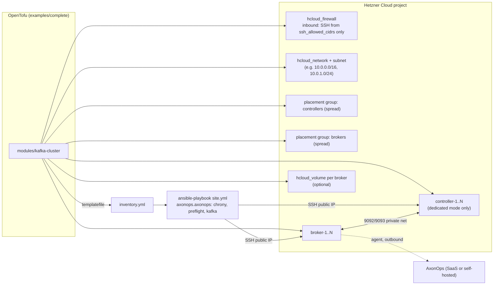

# Architecture — terraform-hetzner-kafka

## 1. Product vision

**Problem.** Standing up a production-shaped Apache Kafka cluster on Hetzner Cloud is manual: servers, private networking, firewalls, disks and KRaft quorum layout must all line up before Kafka can be configured.

**Solution.** A reusable OpenTofu module that provisions the Hetzner Cloud infrastructure for a KRaft Kafka cluster and emits an Ansible inventory. The `axonops.axonops` Ansible collection (`kafka` role) then installs and configures Kafka.

**Users.** Digitalis engineers and customers who run Kafka on Hetzner Cloud.

**Business value.** Repeatable, reviewed, low-cost Kafka clusters in minutes, monitored by AxonOps.

## 2. MVP definition

### In scope

- `modules/kafka-cluster`: Hetzner network, subnet, firewall, spread placement groups, servers, optional data volumes, Ansible inventory output.
- Selectable topology: **combined** (broker + controller on the same node) or **dedicated** controller pool.
- User-selectable broker count, controller count, server types, image, location, SSH keys, allowed SSH CIDRs, volume size, labels.
- `examples/complete`: root configuration using the module, writing `inventory.yml`.
- `ansible/`: `requirements.yml` pinning `axonops.axonops`, `site.yml` (chrony, preflight, kafka roles), `group_vars` example.
- Root `Makefile` driving the full lifecycle: `plan`, `apply`, `inventory`, `galaxy` (install collection), `ping`, `configure` (run playbook), `smoke-test`, `test` (compliance), `fmt`, `lint`, `docs`. `destroy` kept but guarded by explicit confirmation.
- terraform-compliance BDD tests against `tofu plan` (happy path + invalid inputs).
- Branded README with quick start.

### Out of scope (MVP)

- TLS / SASL / ACLs (role supports them; enabled in Iteration 2).
- Public client access to Kafka.
- Multi-location clusters and rack awareness.
- Bastion / private-only servers (no public IP).
- Automated KRaft quorum reconfiguration when controller membership changes.
- Hetzner Robot (dedicated servers), load balancers, DNS.

### Success metrics

- `tofu apply` + `ansible-playbook site.yml` produce a healthy 3-node cluster in < 15 minutes.
- Produce/consume smoke test passes over the private network.
- No Kafka port reachable from the public internet.
- CI green: `tofu validate`, tflint, trivy, terraform-compliance.

## 3. System architecture

### Components

| Component | Purpose |
|-----------|---------|
| `local.nodes` | Map `name → {role, node_id, kafka_roles, server_type, volume}` built from counts. Single source of truth for servers, volumes, inventory. |
| `hcloud_network` / `hcloud_network_subnet` | Private network. Kafka advertises private IPs only. |
| `hcloud_firewall` | Applied to every node. Inbound SSH (22/tcp) from `ssh_allowed_cidrs`; ICMP optional. All other public inbound denied. Private network traffic is not filtered by Hetzner firewalls. |
| `hcloud_placement_group` | One `spread` group per pool (brokers, controllers). Limit 10 servers per group. |
| `hcloud_server` | `for_each = local.nodes`. Public IPv4 kept for SSH and package egress. Attached to subnet with deterministic private IP. |
| `hcloud_volume` + attachment | Created only when `volume_size_gb > 0`; one per broker. cloud-init waits up to 120 s for the device, then mounts it at `/var/lib/kafka` with `defaults,nofail`. `delete_protection` on by default. |
| `hcloud_ssh_key` | Created from `ssh_public_keys`; merged with existing `ssh_key_names`. |
| Inventory template | YAML inventory: group `kafka`, per-host `ansible_host` (public IP), `kafka_node_ip` (private IP), `kafka_node_id`, `kafka_node_roles`. |

### Topology and node IDs

- **Combined** (`dedicated_controllers = false`): `broker_count` nodes. The first `controller_count` brokers (default 3, or 1 when `broker_count < 3`) run `[broker, controller]`; the rest run `[broker]`. Node IDs 1..N.
- **Dedicated** (`dedicated_controllers = true`): `controller_count` (3 or 5) controller-only nodes with IDs 1..N; broker IDs 101..(100+broker_count).
- `controller_count` must be odd (1, 3, 5). Keys are stable (`broker-1`, `controller-1`), so changing counts adds or removes only the tail nodes.
- KRaft uses static `controller.quorum.voters` in the role. Changing controller membership after first boot is unsupported in MVP and documented as such.

### Data flow

1. `make apply` creates infrastructure and renders `inventory.yml` (no secrets).
2. `make galaxy configure` runs `ansible-galaxy collection install -r ansible/requirements.yml` and `ansible-playbook -i inventory.yml ansible/site.yml`. The kafka role formats KRaft storage, starts services, and (optionally) installs the AxonOps agent.
3. `make smoke-test` produces and consumes a test message over the private network.

### AuthN / AuthZ

- Hetzner API token via `HCLOUD_TOKEN` environment variable only.
- SSH key-based root access for Ansible; no root password set when SSH keys are supplied; sshd hardening is out of scope for MVP.
- Kafka: PLAINTEXT on the private network in MVP. TLS + SASL/SCRAM in Iteration 2. Secrets (SASL passwords, AxonOps key) live in Ansible Vault, never in Terraform state.

### Observability

AxonOps agent installed by the kafka role (`kafka_axonops_agent_enabled`). Hetzner server metrics available in the console.

### CI/CD

GitHub Actions: `tofu fmt -check`, `tofu validate`, tflint, trivy, terraform-compliance against a plan generated with a dummy token and `-refresh=false`. No apply in CI.

### State

Local state by default; a remote S3-compatible backend (e.g. Hetzner Object Storage) is recommended and enabled by uncommenting `backend "s3" {}` in `examples/complete/backend.tf` (ADR-0007, superseding ADR-0006). The module itself declares no backend.

## 4. Technology decisions

| ADR | Decision |
|-----|----------|
| [0001](adr/0001-hetzner-cloud-opentofu.md) | Hetzner Cloud with `hetznercloud/hcloud` provider, OpenTofu |
| [0002](adr/0002-inventory-handoff-to-ansible.md) | Terraform renders inventory; Ansible runs as a separate step |
| [0003](adr/0003-single-module-node-map-topology.md) | Single module, internal node map, combined or dedicated controllers |
| [0004](adr/0004-private-network-kafka.md) | Kafka on private network only; public firewall allows SSH only |
| [0005](adr/0005-optional-volume-storage.md) | Optional Hetzner volume per broker, mounted by cloud-init |
| [0007](adr/0007-local-state-default-s3-recommended.md) | Local state by default; S3 remote state recommended (supersedes 0006) |
| [0006](adr/0006-state-backend-hetzner-object-storage.md) | Superseded by 0007. Remote state on Hetzner Object Storage (S3 backend) |

## 5. Risks

| Risk | Type | Likelihood | Impact | Mitigation | Owner |
|------|------|-----------|--------|-----------|-------|
| Kafka binds `:9092` on all interfaces; public exposure if firewall misconfigured | Security | Medium | High | Firewall default-deny, compliance test asserting no 9092/9093 public rule, smoke test from outside | terraform-specialist |
| Changing controller count after bootstrap breaks static KRaft quorum | Operational | Medium | High | Validation + README warning; `lifecycle` docs; Iteration 3 runbook | kafka-config-reviewer |
| Volume reformatted on server replace → data loss | Operational | Low | High | cloud-init formats only when no filesystem (`blkid` check); `delete_protection` on volumes | terraform-specialist |
| `user_data` change forces server replacement | Operational | Medium | High | `lifecycle { ignore_changes = [user_data, image, ssh_keys] }` | terraform-specialist |
| Spread placement group limit (10 servers) | Technical | Low | Medium | One group per pool; validation per placement group (brokers <= 10, controllers <= 5) | terraform-specialist |
| PLAINTEXT Kafka in MVP | Security | High | Medium | Private network only; TLS/SASL in Iteration 2 | security-reviewer |
| Ansible picks public IP as `ansible_default_ipv4` | Technical | High | High | Inventory sets `kafka_node_ip` to private IP explicitly | terraform-specialist |
| ARM server types (`cax*`) untested with java/kafka roles | Technical | Low | Medium | Default `cpx`/`ccx` x86; document ARM as untested | qa-tester |

## 6. Assumptions

- Hetzner Cloud only (not Robot). Single location per cluster, inside one network zone.
- Default image `ubuntu-24.04` (supported by the kafka role).
- Kafka 4.x KRaft only (role is KRaft-only).
- Kafka clients run inside the same Hetzner private network.
- Ansible runs from the operator's machine with SSH access to public IPs.
